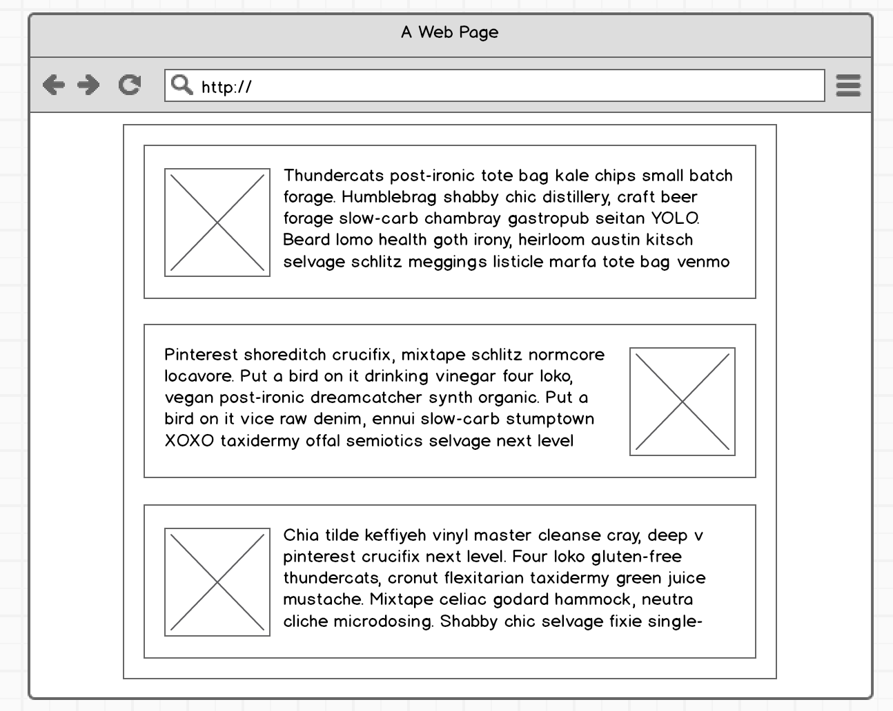
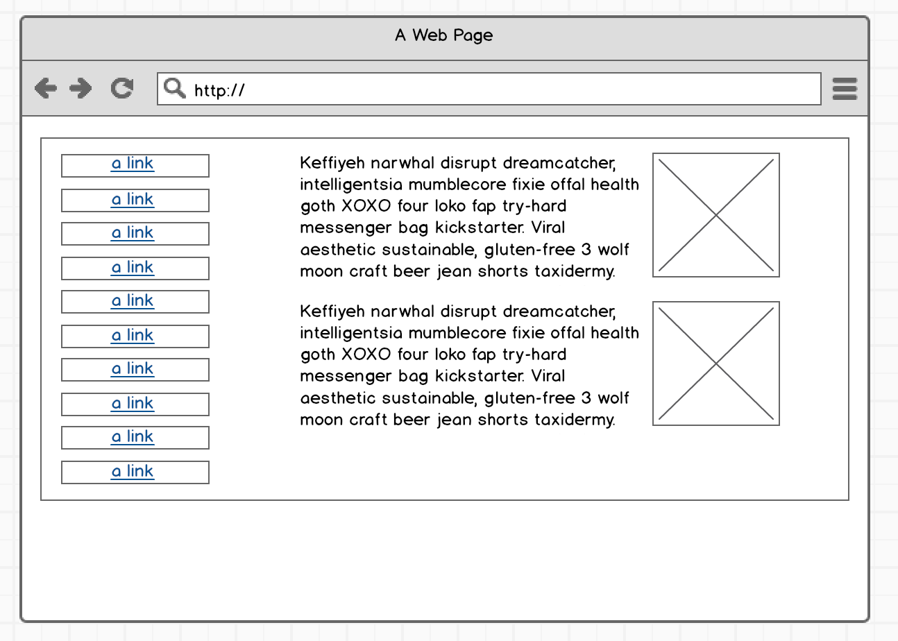

# Bootstrap Mockup Assignment

For this exercise, you will be using your knowledge of HTML and Twitter Bootstrap to code the mockups inside this repository.

Fork/Clone the repo and make a pull request when done.

# Bonus

Complete the same mockups using [Materialize CSS framework](https://materializecss.com/).
